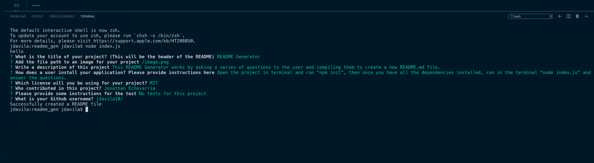

  # README Generator

  ---

  

 ---

  

  ---

  ## Table of Contents

  - [Image](#image)
  - [Description](#description)
  - [Installation](#installation)
  - [License](#license)
  - [Contributors](#contributors)
  - [Contact](#contact)

  ---  
  

  ## Description

  This README Generator works by asking a series of questions to the user and compiling them to create a new README.md file.

  
  This README Generator uses node JS and it works by asking a series of questions to the user and compiling them to create a new README.md file.

  ---
  

  ## Installation
  
  Open the project in terminal and run “npm init”, then once you have all the dependencies installed, run in the terminal “node index.js” and answer the questions.

 
  ---

  ## License

  MIT

  ---

  ## Contributors

  Jonathan Echevarria

  ---
    
  
  ## Contact:

  For questions about my README generator please go to my Github page following this link: 
  - [Github Profile](https://github.com/jdavila10/)
  Or by email at: j.eche589@gmail.com
  
  
